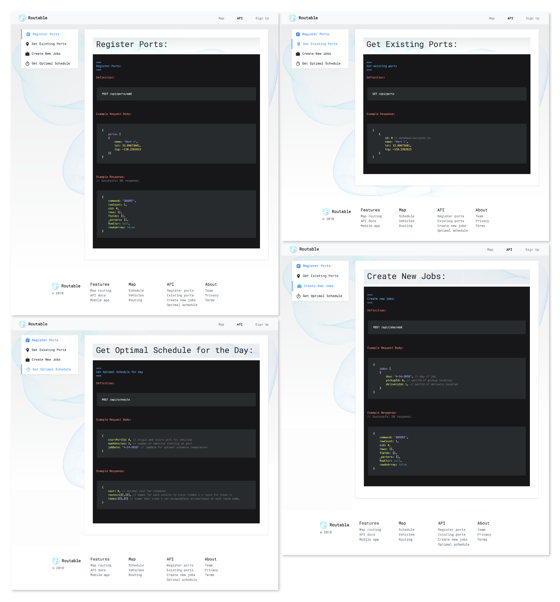

Routable
---

### Concept

Ports and delivery centers still struggle to optimize scheduling because of data siloing. Routable is a neutral third party hosted solution which is able to optimize scheduling across multiple centers - without sharing any data with other parties - so that drivers' time can be saved, gas can be saved, and more deliveries can be served at any given delivery center or port.

View the pitch deck here: <a href="https://docs.google.com/presentation/d/1rC6jKaGLiJJWgyQHkIo4bEdZeTz1ex22JDnd4DLX3EQ/edit?usp=sharing">Pitch Deck</a>

### Structure

<ul>
<li>*/server*: Server and api for submitting scheduling data.</li>
<li>*/RoutableApp*: Mobile app designed for providing schedule/ information specific to each driver.</li>
<li>*/RoutableWeb*: Client side reactjs website</li>
</ul>

Check the `README.md` files in each subfolder for more information.

### Screenshots

    <h3>Login Page</h3>
        
    <h3>Routable Home Page</h3>
        
    <h3>Detailed Routing (Expanded View)</h3>
        
    <h3>Map Route Page</h3>
        
    <h3>API Documentation</h3>
        

### TODO:

* Create Logo. X
* Update pitch deck in drive folder. X
* Create API documentation. Understand the api interfaces and json body formats. X
* Finish 3 core API routes: add port, add job, query schedule.X
* Add master google maps page to website. X
* Research - what is the schedule data format that ports use. What kind of data will we most likely have access to, and how can this be inserted into this framework for pathfinding: https://github.com/mapbox/node-or-tools X
* Create basic marketing website UI design / or use framework that allows plugging in an API doc page. X
* Add tests to server code and routing. X
* Check jobs table for duplicates. X

### Dev Notes
